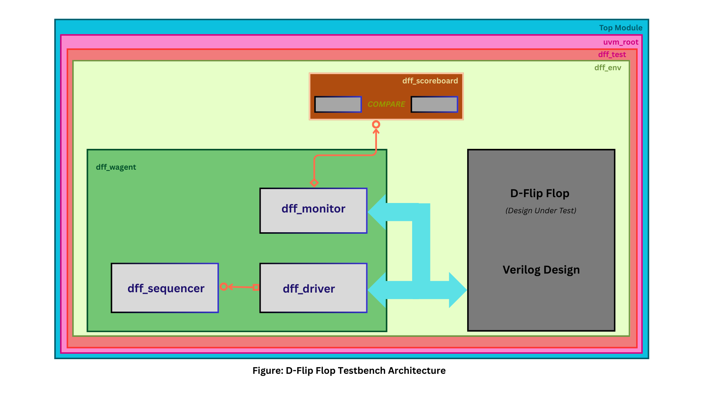
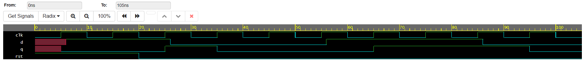

# D Flip-Flop Design Verification Using UVM

## 📝 Description
This repository contains a complete **Universal Verification Methodology (UVM)** testbench designed to verify the functionality of a **D-Flip Flop (DFF)**. The project demonstrates a robust verification environment capable of checking synchronous reset behavior, data integrity, and timing accuracy.

The testbench addresses common verification challenges, such as **Delta Cycle "Race Conditions"**, ensuring that the monitor samples the correct values relative to the clock edge using precise timing controls.

## Testbench Architecture

The D-Flip Flop testbench is built using the Universal Verification Methodology (UVM) architecture. At the top level, the `Top Module` instantiates the Design Under Test (the Verilog `D-Flip Flop`) and the UVM test components. The testbench environment (`dff_env`) contains an active agent (`dff_wagent`) and a scoreboard (`dff_scoreboard`).

Within the agent, the `dff_sequencer` passes transaction objects to the `dff_driver`, which then drives stimulus to the D-Flip Flop inputs. The `dff_monitor` observes the signals at the D-Flip Flop interface and converts them back into transaction objects. These monitored transactions are sent to the `dff_scoreboard`, which compares the actual output from the design against the expected values to verify correctness.

## Simulation Waveform

The following image shows the waveform results from the D-Flip Flop verification simulation.

## 🛠 Tools Used
- **Simulator:** Synopsys VCS
- **Language:** SystemVerilog
- **Methodology:** UVM 1.2

## 🚀 How to Run
### 1. Run Online (EDA Playground)
You can view, compile, and run this project directly in your browser using the link below:
[**▶️ Launch on EDA Playground**](https://www.edaplayground.com/x/nUUA)

# 📂 Project Structure

| Main Folder | File Name | 📄 Description |
| :--- | :--- | :--- |
| **📂 design** | `dff.sv` | The **RTL Design** code for the D-Flip Flop. |
| **📂 verification_testbench** | `main.sv` | **Package/Include File**: Includes all UVM components and macros. |
| | `top.sv` | **Top Module**: Connects the DUT, Interface, and generates the clock. |
| | `dff_intf.sv` | **Interface**: Defines signals and clocking blocks for Driver/Monitor. |
| | `config.sv` | **Configuration**: Contains global macros and variable definitions. |
| | `dff_tx.sv` | **Transaction**: The UVM Sequence Item class. |
| | `dff_seq_lib.sv` | **Sequences**: Defines `base_seq` and `basic_seq` for test patterns. |
| | `dff_sqr.sv` | **Sequencer**: Typedef for the default UVM sequencer. |
| | `dff_drv.sv` | **Driver**: Drives transaction data to the DUT interface. |
| | `dff_mon.sv` | **Monitor**: Samples signal activity (with timing fixes) from the interface. |
| | `dff_agnt.sv` | **Agent**: Encapsulates the Driver, Monitor, and Sequencer. |
| | `dff_sbd.sv` | **Scoreboard**: Compares actual output vs. expected output (`missmatch` check). |
| | `dff_env.sv` | **Environment**: Container for the Agent and Scoreboard. |
| | `dff_test_lib.sv` | **Tests**: Library containing `base_test` and `basic_test`. |
| **📂 img** | `tb_architecture.png` | Diagram showing the UVM hierarchy and connections. |
| | `waveform.png` | Snapshot of the simulation waveform output. |

# 📜 Details and Contribution

## 👤 Author
- **Name**: Karankumar Nevage
- **Email**: 📧 karanpr9423@gmail.com
- **LinkedIn**: 🔗 [https://www.linkedin.com/in/karankumar-nevage/](https://www.linkedin.com/in/karankumar-nevage/)

## 🤝 Contributing
Feel free to fork this repository, submit issues, or create pull requests for enhancements. Contributions to add new test sequences or improve coverage are welcome! 🛠️

## 📄 License
This project is licensed under the MIT License - see the [LICENSE](LICENSE) file for details.

## 📌 Project Status
- **Last Updated**: 📅 January 08, 2026
- **Current Version**: 🚀 1.0
